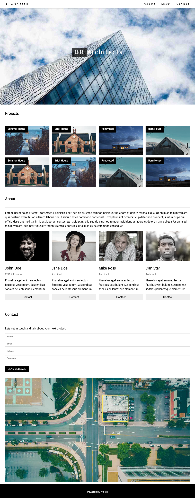
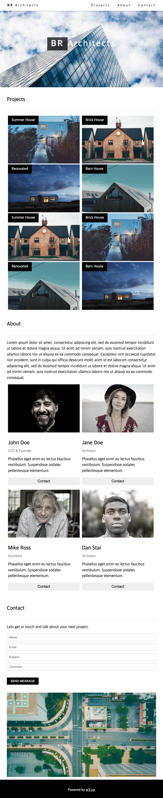
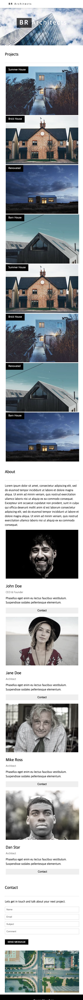

# 유지인 React 클론코딩(2) 과제

> 2022-10-27

## index.js

```javascript
/**
 * @filename: index.js
 * @description: 프로그램 시작점.
 *               전역 스타일(GlobalSytels)과 전역 SEO 구성(Meta),
 *               라우팅 범위를 설정(BrowerRouter)하고 프로그램을 시작(App)한다.
 */

/** 패키지 참조 */
import React from 'react';
import ReactDOM from 'react-dom/client';
import App from './App';
// 라우팅 범위 설정
import { BrowserRouter } from 'react-router-dom';
// SEO 구현
import Meta from './Meta';
// 전역 스타일 정의
import GlobalStyle from './GlobalStyle';

const root = ReactDOM.createRoot(document.getElementById('root'));
root.render(
  <React.StrictMode>
    <Meta />
    <GlobalStyle />
    <BrowserRouter>
      <App />
    </BrowserRouter>
  </React.StrictMode>
);
```


## App.js

```javascript
/**
 * @filename: App.js
 * @description: 레이아웃 구성 컨테이너
 */

/** 패키지 참조 */
import React from "react";
// 라우팅처리
import {Routes, Route} from 'react-router-dom';
// 모든 페이지 공용 컴포넌트
import Header from "./common/Header";
import Footer from './common/Footer';
import Main from './pages/Main';

/**
 * 기본 레이아웃 구성 함수
 * @returns {JSX.Element}
 */
function App() {
  return (
   <div>
    <Header />
    <Routes>
      <Route path='/' exact={true} element={<Main />} />
    </Routes>
    <Footer />
   </div>
  );
};

export default App;

```


## GlobalStyle.js

```javascript
/**
 * @filename: GlobalStyles.js
 * @description: 전역으로 적용될 기본 스타일시트.
 *               이 파일에서 정의한 class는 RecatJSX에서 className 속성으로 참조해야 한다.
 */

/** 패키지 참조 */
import { createGlobalStyle } from "styled-components";
// reset.css
import reset from "styled-reset";

/**
 * 전역 스타일 시트를 정의한 객체
 * @type {GlobalStyleComponent}
 */
const GlobalStyle = createGlobalStyle`
    ${reset}

    body {
        margin: 0;
        padding: 0;

  }

    a {
        text-decoration: none;
    }

    h3 {
        padding: 30px 0 16px 0;
        font-size: 24px;
        font-weight: 500;
    }

    p {
        font-size: 17px;
        margin : 15px 0;
        line-height: 1.5;
}

    hr {
        margin : 20px 0px;
        border-top : 0.3px solid #eee;
    }
`;

export default GlobalStyle;
```

## common/Header.js

```javascript
/**
 * @filename: Header.js
 * @description: Header 공통 컴포넌트
 */

/** 패키지 참조 */
import React, { memo } from 'react';
import styled from 'styled-components';
import { HashLink } from 'react-router-hash-link';
import mq from '../MediaQuery';

// import mq from '../MediaQuery';

/** Header 컴포넌트 스타일 정의 */
const HeaderContainer = styled.header`
    position: fixed;
    top: 0;
    z-index: 9999;
    width: 100%;
    background: #fff;
    box-shadow: 0 2px 5px 0 rgba(0, 0, 0, .2);
    padding: 8px 16px;
    box-sizing: border-box;

    .navwrap {
        display: flex;
        justify-content: space-between;
        align-items: center;

        a {
        padding: 8px 16px;
        letter-spacing: 4px;
        font-size: 15px;
        color: #000;

        &:hover {
            background: rgba(0, 0, 0, 0.2);
        }

        span {
            font-weight: bolder;
        }
        
        }

        .gnb {
            ${mq.maxWidth('sm')`
            display: none;
            `}
        }
    }
`;

const Header = memo(() => {
  return (
    <HeaderContainer>
        <div className='navwrap'>
            <HashLink to='#'><span>BR</span> Architects</HashLink>
            <div className='gnb'>
                <HashLink to='/#Projects'>Projects</HashLink>
                <HashLink to='/#About'>About</HashLink>
                <HashLink to='/#Contact'>Contact</HashLink>
            </div>
        </div>
    </HeaderContainer>
  );
});

export default Header;
```

## common/Footer.js

```javascript
/**
 * @filename: Footer.js
 * @description: Footer 공통 컴포넌트
 */

/** 패키지 참조 */
import React, { memo } from 'react';
import styled from 'styled-components';
import mq from '../MediaQuery';

/** Footer 컴포넌트 스타일 정의 */
const FooterContainer = styled.footer`
  width : 100%;
  height: 40px;
  background-color: #000;
  padding: 20px 0;

  ${mq.maxWidth('sm')`
    padding: 10px;
  `}

  p {
    text-align: center;
    line-height: 20px;
    font-size: 15px;
    color : #fff;

    a {
      text-decoration: underline;
      color : #fff;
    }
  }
`;

/**
 * 페이지 하단 컴포넌트 구현
 * @returns {JSX.Element}
 */
const Footer = memo(() => {
  return (
    <FooterContainer>
    <p>Powered by <a href="https://www.w3schools.com/w3css/default.asp" rel="noreferrer">w3.css</a></p>
  </FooterContainer>
  );
});

export default Footer;
```

## pages/Main/index.js

```javascript
/**
 * @filename: index.js
 * @description: 메인 페이지 구성
 */

/** 패키지 참조 */
import React from 'react';
import styled from 'styled-components';
import Jumbotron from './Jumbotron';
import Project from './Project';
import About from './About';
import Contact from './Contact';

// 메인페이지 영역에 대한 스타일 정의
const MainContainer = styled.section`
  width: 100%;
`;

/**
 * 메인페이지 레이아웃 구성 함수
 * @returns {JSX.Element}
 */
const Main = () => {
  return (
    <MainContainer>
        <Jumbotron />
        <Project />
        <About />
        <Contact />
    </MainContainer>
  );
};

export default Main;
```

## pages/Main/Jumbotron.js

```javascript
/**
 * @filename: Jumbotron.js
 * @description: Jumbotron 영역 컴포넌트
 */

/** 패키지 참조 */
import React, {memo} from 'react';
import styled from 'styled-components';
import img from '../../assets/img/header.jpg';

/** Jumbotron 컴포넌트 스타일 정의 */
const JumbotronContainer = styled.div`
  max-width: 1500px;
  margin: auto;
  position: relative;

  img {
    width: 100%;
    object-fit: cover;
  }

  h1 {
    font-size: 38px;
    color : #fff;
    letter-spacing: 5px;
    position: absolute;
    z-index: 1;
    left: 50%; 
    top: 50%;
    transform: translate(-50%,-50%); 

    span {
        font-weight: bolder;
        background-color: #000;
        opacity: 0.75;
        padding: 6px 16px;
    }
  }

`;

/**
 * Jumbotron 컴포넌트 구현
 * @returns {JSX.Element}
 */
 const Jumbotron = memo(() => {
    return (
      <JumbotronContainer>
        
        <div>
          <h1><span>BR</span>Architects</h1>
        </div>
      </JumbotronContainer>
    )
  });

export default Jumbotron;
```

## pages/Main/Project.js

```javascript
/**
 * @filename: Project.js
 * @description: Project 영역 컴포넌트
 */

/** 패키지 참조 */
import React, { memo } from 'react';
import styled from 'styled-components';
import mq from '../../MediaQuery';
import img01 from '../../assets/img/img01.jpg'
import img02 from '../../assets/img/img02.jpg'
import img03 from '../../assets/img/img03.jpg'
import img04 from '../../assets/img/img04.jpg'

/** 메인 Project 영역 스타일 정의 */
const ProjectContainer = styled.div`
    padding: 8px 30px;

    ul {
        display: flex;
        ${mq.maxWidth('sm')`
            flex-wrap: wrap;
        `}

        ${mq.maxWidth('md')`
            flex-wrap: wrap;
        `}

        li {
            width: 25%;
            margin : 0 15px 8px 0;
            position: relative;

            ${mq.maxWidth('md')`
                margin : 0 5px;
                width: 48%;
            `}

            ${mq.maxWidth('sm')`
                width: 100%;
            `}

            &:last-child {
                margin-right: 0;
            }

           div {
                color: #fff;
                background-color: #000;
                position: absolute;
                z-index: 1;
                padding: 8px 16px;
                line-height: 1.5;
           }
            
            img {
                width: 100%;
                object-fit: cover;
            }
        }
    }
`;

// 이미지와 제목에 대한 JSON 배열
const imgList = [
    {img: img01, title: 'Summer House'},
    {img: img02, title: 'Brick House'},
    {img: img03, title: 'Renovated'},
    {img: img04, title: 'Barn House'},
]

const imgList2 = [
    {img: img02, title: 'Summer House'},
    {img: img01, title: 'Brick House'},
    {img: img04, title: 'Renovated'},
    {img: img03, title: 'Barn House'},
]

/**
 * 페이지 하단 컴포넌트 구현
 * @returns {JSX.Element}
 */
const Project = memo(() => {
  return (
    <ProjectContainer>
        <h3>Projects</h3>
        <hr />
        <ul>
            {imgList.map(({img, title}, i) => {
                return (
                    <li key={i}>
                        <div>{title}</div>
                        
                    </li>
                )
            })}
        </ul>
        <ul>
            {imgList2.map(({img, title}, i) => {
                return (
                    <li key={i}>
                        <div>{title}</div>
                        
                    </li>
                )
            })}
        </ul>
    </ProjectContainer>
  )
});

export default Project;
```

## pages/Main/About.js

```javascript
/**
 * @filename: About.js
 * @description: About 영역 컴포넌트
 */

/** 패키지 참조 */
import React, { memo } from 'react';
import styled from 'styled-components';
import mq from '../../MediaQuery';
import img1 from '../../assets/img/img1.jpg'
import img2 from '../../assets/img/img2.jpg'
import img3 from '../../assets/img/img3.jpg'
import img4 from '../../assets/img/img4.jpg'


/** 메인 About 영역 스타일 정의 */
const AboutContainer = styled.div`
    padding: 8px 30px;
    ul {
        display: flex;

        ${mq.maxWidth('sm')`
            flex-wrap: wrap;
        `}

        ${mq.maxWidth('md')`
            flex-wrap: wrap;
        `}

        li {
            width: 25%;
            margin : 0 15px 8px 0;

            ${mq.maxWidth('md')`
                margin : 0 5px;
                width: 48%;
            `}

            ${mq.maxWidth('sm')`
                width: 100%;
            `}

            &:last-child {
                margin-right: 0;
            }

            img {
                width: 100%;
                object-fit: cover;
                filter: grayscale(0.75);

            }

            h2 {
                color: #757575;
            }

            button {
                width: 100%;
                cursor: pointer;
                border : none;
                padding : 8px 16px;
                font-size: 16px;
                margin-bottom: 20px;
            }
        }
    }
`;

// 이미지와 제목에 대한 JSON 배열
const imgList = [
    {img: img1, name: 'John Doe', job: 'CEO & Founder', text:'Phasellus eget enim eu lectus faucibus vestibulum. Suspendisse sodales pellentesque elementum.' },
    {img: img2, name: 'Jane Doe',  job: 'Architect', text:'Phasellus eget enim eu lectus faucibus vestibulum. Suspendisse sodales pellentesque elementum.' },
    {img: img3, name: 'Mike Ross',  job: 'Architect', text:'Phasellus eget enim eu lectus faucibus vestibulum. Suspendisse sodales pellentesque elementum.' },
    {img: img4, name: 'Dan Star',  job: 'Architect', text:'Phasellus eget enim eu lectus faucibus vestibulum. Suspendisse sodales pellentesque elementum.' },
]

/**
 * 페이지 하단 컴포넌트 구현
 * @returns {JSX.Element}
 */
const About = memo(() => {
  return (
    <AboutContainer>
        <h3>About</h3>
        <hr />
        <p>
            Lorem ipsum dolor sit amet, consectetur adipiscing elit, sed do eiusmod tempor incididunt ut labore et dolore magna aliqua. Ut enim ad minim veniam, quis nostrud exercitation ullamco laboris nisi ut aliquip ex ea commodo consequat. Excepteur sint occaecat cupidatat non proident, sunt in culpa qui officia deserunt mollit anim id est laborum consectetur adipiscing elit, sed do eiusmod tempor incididunt ut labore et dolore magna aliqua. Ut enim ad minim veniam, quis nostrud exercitation ullamco laboris nisi ut aliquip ex ea commodo consequat.
        </p>
        <ul>
            {imgList.map(({img, name, job, text}, i) => {
                return (
                    <li key={i}>
                        
                        <h3>{name}</h3>
                        <h2>{job}</h2>
                        <p>{text}</p>
                        <button type='button'>Contact</button>
                    </li>
                );
            })}
        </ul>

    </AboutContainer>
  );
});

export default About;
```

## pages/Main/Contact.js

```javascript
/**
 * @filename: Contact.js
 * @description: Contact 영역 컴포넌트
 */

/** 패키지 참조 */
import React, { memo } from 'react';
import styled from 'styled-components';
import img from '../../assets/img/last.jpg'

/** 메인 Contact 영역 스타일 정의 */
const ContactContainer = styled.div`
    padding : 8px 30px;

    form {
        input {
        display: block;
        width: 100%;
        box-sizing: border-box;
        border : 1px solid #ccc;
        padding: 8px;
        margin-bottom: 10px;
        }  

        button {
            background: #000;
            color : #fff;
            border: none;
            padding: 8px 16px;
            margin : 20px 0 35px 0;
        }
    } 

    img {
        width: 100%;
        object-fit: cover;
    }
`;

// input 태그 생성을 위한 배열
const inputArr = ['Name', 'Email', 'Subject', 'Comment'];

/**
 * 페이지 하단 컴포넌트 구현
 * @returns {JSX.Element}
 */
const Contact = memo(() => {
  return (
    <ContactContainer>
        <h3>Contact</h3>
        <hr />
        <p>Lets get in touch and talk about your next project.</p>
        <form>
            {inputArr.map((v, i) => {
                return (
                    <input key={i} type="text" placeholder={v}></input>
                )
            })}
            <button type="button"><i>SEND MESSAGE</i></button>
        </form>
        
    </ContactContainer>
  )
});
export default Contact;
```

desktop

tablet

mobile

